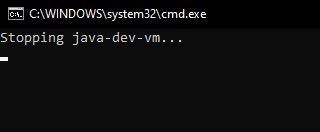
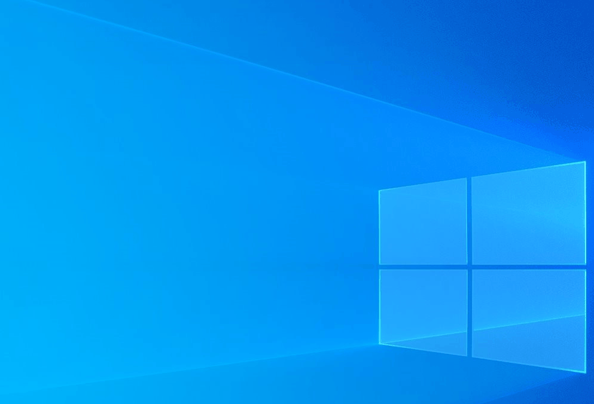

<p align="center">
    
</p>

<p align="center">
  <a href="https://hub.docker.com/r/javowiec/ubuntu-dev-vm" rel="noreferrer">
      
  </a>
  <a href="https://github.com/P-Marcin/ubuntu-dev-vm/releases" rel="noreferrer">
      
  </a>
  <a href="LICENSE.md" rel="noreferrer">
      
  </a>
</p>

## :pushpin: Introduction

Ubuntu DEV VM for Java Developers running on Windows in container.

It requires **3** dependencies:

* [**WSL version 2**](https://learn.microsoft.com/en-us/windows/wsl/install) (Windows Subsystem for Linux) - lets you
  install a Linux distribution and use Linux applications, utilities, and Bash command-line tools directly on Windows,
  unmodified, without the overhead of a traditional virtual machine or dualboot setup
* [**Docker Desktop**](https://docs.docker.com/desktop/install/windows-install/) - lets you build, share, and run
  containerized applications and microservices. It provides a straightforward GUI (Graphical User Interface) that lets
  you manage your containers, applications, and images directly from your machine
* [**MobaXterm Home Edition**](https://mobaxterm.mobatek.net/download.html) (X11 server) - lets you display
  applications (e.g. [IntelliJ IDEA](https://www.jetbrains.com/idea/)) from Ubuntu DEV VM on your Windows

Ubuntu DEV VM image can be pulled from DockerHub: https://hub.docker.com/r/javowiec/ubuntu-dev-vm:

* `-community` version contains IntelliJ
  IDEA [Community Edition](https://www.jetbrains.com/products/compare/?product=idea&product=idea-ce)
* `-ultimate` version contains IntelliJ
  IDEA [Ultimate Edition](https://www.jetbrains.com/products/compare/?product=idea&product=idea-ce)

Container from image can be started with batch script (more in next section):



After container is started, you'll see the panel with the applications having graphical interface:


For example IntelliJ IDEA:



All applications having graphical interface (even the ones not included in the panel,
e.g. [gedit text editor](https://help.gnome.org/users/gedit/stable/)) open as a separate window which you can move
freely:


## :pushpin: First Setup and Start

### 1. Installation

Please follow linked official documentation and install all **3** dependencies mentioned above.

### 2. Setup

#### 2.1. WSL configuration file

You can place a `.wslconfig` file in `C:\Users\${username}` where you can configure the amount of memory or the number
of logical processors you want to assign to Docker Desktop.

Example:

```
[wsl2]
memory=10GB
processors=6
swap=0
```

Full documentation: https://learn.microsoft.com/en-us/windows/wsl/wsl-config#wslconfig

#### 2.2. MobaXterm Home Edition

MobaXterm Home Edition consumes really low RAM (around 20MB, with IntelliJ IDEA open only 43,5MB RAM), so I suggest to
make it run with Windows startup:

* Run `Windows Key` + `R` shortcut and type: `shell:startup`
* Add MobaXterm shortcut to `Autostart` directory
* To start MobaXterm immediately minimized into the system tray add `-hideterm` property after `MobaXterm.exe"` in the
  Target field in Shortcut tab:


### 3. Start

Make sure MobaXterm is started. Then start Docker Desktop. After that start Ubuntu DEV VM container. Enjoy!

See example batch script which starts or restarts Ubuntu DEV VM: [restart.bat](batch-scripts/restart.bat). Change the
value of `imageVersion` variable if there is newer version available.

Batch scripts can be executed on Windows in CMD/PowerShell or with double mouse click.

### 4. Quit

Quit Docker Desktop to quit Ubuntu DEV VM.

## :pushpin: Persisting changes

By default, Docker containers do not persist changes. You'll need to
use [volumes](https://docs.docker.com/storage/volumes/) to enable persistence.

In [restart.bat](batch-scripts/restart.bat) I defined **5** volumes:

* `projects` under `/home/dev/projects` - a place where you can start your projects
* `maven` under `/home/dev/.m2/repository` - local [Maven](https://maven.apache.org/) repository where artifacts are
  stored
* `home` under `/home/dev` - home directory of Ubuntu DEV VM user
* `docker` under `/var/lib/docker` - a place where docker stores the data (e.g. downloaded images)
* `/mnt/shared` - a shared place between Ubuntu DEV VM and `C:\Users\${username}\shared` on Windows

## :pushpin: Known Issues

### VHDX disk grows over time - how to shrink it?

Deleting data in Docker Desktop (e.g. images, volumes) does not cause the size
of [VHDX (Virtual Hard Disk)](https://en.wikipedia.org/wiki/VHD_(file_format)) to decrease. Once the VHDX grows it will
remain that size, or grow larger as the amount of data increases.

You can check the size of your Docker Desktop VHDX file under path: `%LOCALAPPDATA%\Docker\wsl\disk` (`%LOCALAPPDATA%`
is Windows environment variable which resolves to `C:\Users\${username}\AppData\Local`).

If you want to recover some of the disk space on Windows that is being consumed by the VHDX, you can shrink the VHDX.

See example batch script which automates the shrinking of VHDX
via [diskpart](https://learn.microsoft.com/en-us/windows-server/administration/windows-commands/diskpart) Windows
utility: [shrink-vhdx.bat](batch-scripts/shrink-vhdx.bat). Change the value of `vhdxFile` and `vhdxPath` variables if
the name/path of your VHDX is different.

**WARNING: Shut down Docker Desktop before running this script**:


Before:


Shrinking:


After:


### Firefox can crash if shared memory size is too low

To prevent crashes from happening when running Firefox inside Ubuntu DEV VM, the size of the shared memory located at
`/dev/shm` must be increased. The issue is documented [here](https://bugzilla.mozilla.org/show_bug.cgi?id=1338771#c10).

By default, the size in Docker containers is **64MB**, which is not enough. It is recommended to use a size of **2GB**.
This value is arbitrary, but known to work well. Setting the size of `/dev/shm` can be done by adding the
`--shm-size 2g` parameter to the `docker run` command. It is already added to [restart.bat](batch-scripts/restart.bat).

### Missing `overlay2` Storage Driver

To check the Storage Driver inside Ubuntu DEV VM run command: `docker info 2>/dev/null | grep "Storage Driver"`. If it
is not `overlay2`, it means you're missing `--mount source=docker,target=/var/lib/docker` parameter in `docker run`
command. It is already added to [restart.bat](batch-scripts/restart.bat).

Thanks to this, Docker can use `overlay2` as a Storage Driver, otherwise it falls back to `vfs`. Using `vfs` may cause
issues when creating a k3d kubernetes cluster.

## :pushpin: Useful Scripts

On Ubuntu DEV VM there are some useful scripts which you can use. See [docker/scripts](docker/scripts).

For example: if you want to check versions installed (see
also [Releases](https://github.com/P-Marcin/ubuntu-dev-vm/releases) tab), type:


## :pushpin: Useful Aliases

In [`/home/dev/.bash_aliases`](docker/home-config/.bash_aliases) you can find some useful aliases which you can use.

## :pushpin: Useful Docs

* [Accessing application in a Windows browser](docs/accessing-application-in-a-windows-browser.md)
* [Certificate Setup](docs/certificate.md)

## :pushpin: How to build image locally?

Clone or download as a ZIP this repository.

Install Java on Windows: https://www.oracle.com/java/technologies/downloads/

Then use [Maven wrapper](https://maven.apache.org/wrapper/): [mvnw.cmd](mvnw.cmd) and type in PowerShell:

* to build `-community` image:

```bash
.\mvnw.cmd clean package
```

* to build `-ultimate` image:

```bash
.\mvnw.cmd clean package -Pultimate
```

Older releases are removed from DockerHub. If you want to use older release for whatever reason, you need to build it
yourself. In the [Releases](https://github.com/P-Marcin/ubuntu-dev-vm/releases) tab you can find zip with the source
code.

## :pushpin: Copyright & License

Copyright (c) 2024 Marcin P. - Released under the [MIT license](LICENSE.md).
